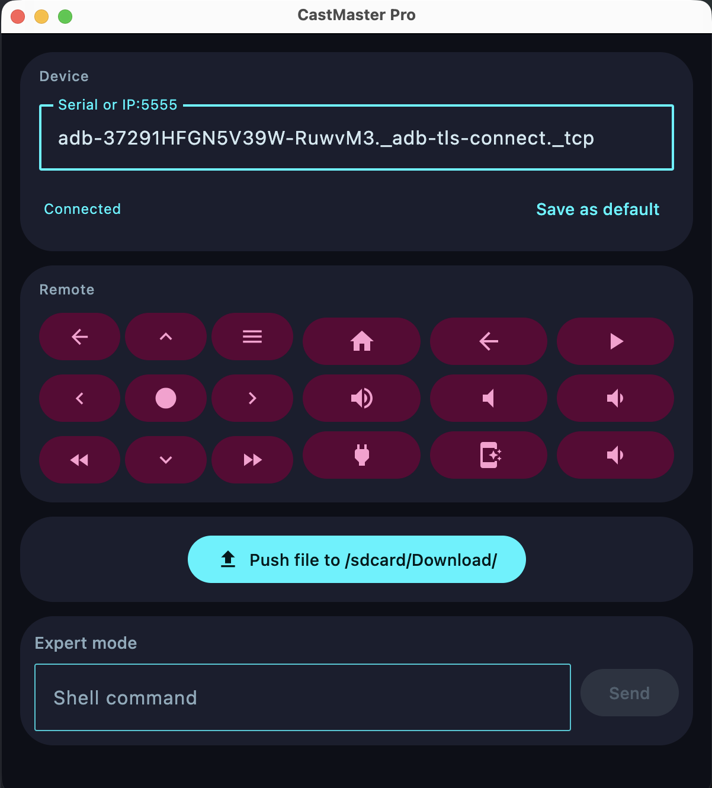

# CastMaster Pro

A desktop remote control for Chromecast and Android TV devices over ADB.



## Features

- Connect via ADB serial or IP:5555
- Full remote control (navigation, playback, volume, home, back, etc.)
- Push files directly to `/sdcard/Download/` on the device
- Expert mode: run arbitrary shell commands
- Save default device for quick reconnect

## Requirements

- [ADB](https://developer.android.com/tools/adb) installed and available in `PATH`
- Android TV / Chromecast with Google TV with ADB debugging enabled

## Run

```shell
./gradlew :composeApp:run
```
